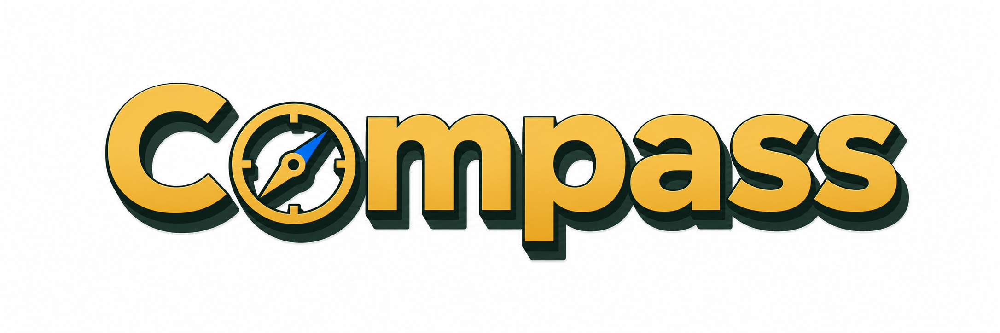

<p align="center">
  
</p>

<h1 align="center">COMPASS Skills</h1>

<p align="center">
  <a href="https://github.com/dongshuyan/compass-skills/stargazers"></a>
  <a href="https://github.com/dongshuyan/compass-skills/forks"></a>
  <a href="LICENSE"></a>
  
  <a href="https://linux.do/"></a>
</p>

<p align="center">
  <a href="README.zh.md">中文</a> · <a href="SECURITY.md">Security</a> · <a href="LICENSE">License</a>
</p>

```bash
npx skills add dongshuyan/compass-skills --skill '*' -a claude-code
```

COMPASS Skills gives AI coding agents four local skills: task clarification, repo-local task memory, AI conversation handoff prompts, and a local collaboration profile.

The project currently ships four `SKILL.md` skills:

| Skill | Purpose |
| --- | --- |
| [`task-clarifier`](skills/task-clarifier/) | Aligns goals, scope, evidence, acceptance criteria, and risk boundaries before ambiguous, costly, or externally visible work. |
| [`task-forest`](skills/task-forest/) | Maintains a repo-local task forest / DAG with goals, subtasks, dependencies, progress, deviations, todos, decisions, and conversation history. |
| [`session-handoff-prompt`](skills/session-handoff-prompt/) | Compresses the current AI conversation's goal, progress, constraints, and next steps into a paste-ready prompt for a new AI conversation. |
| [`user-profile-keeper`](skills/user-profile-keeper/) | Maintains a local, auditable, correctable collaboration profile for communication preferences, risk style, and recurring working context. |

## Quick Start

List the available skills before installing:

```bash
npx skills add dongshuyan/compass-skills --list
```

Install all skills for Claude Code:

```bash
npx skills add dongshuyan/compass-skills --skill '*' -a claude-code
```

Install all skills for both Codex and Claude Code:

```bash
npx skills add dongshuyan/compass-skills --skill '*' -a codex -a claude-code
```

After installation, invoke the skills directly in an AI conversation:

```text
$task-clarifier
$task-forest
$session-handoff-prompt
$user-profile-keeper
```

For manual installation, copy the four folders under [`skills/`](skills/) into the agent's local skills directory and keep their `references/`, `scripts/`, and `agents/` subdirectories intact.

## Why COMPASS Exists

Long-running agent work needs four kinds of state:

- User context: communication preferences, risk boundaries, recurring omissions, and collaboration style.
- Project context: where the current request fits, what it depends on, and how far it has progressed.
- Goal context: how the current task contributes to the original objective and whether it still matches it.
- Handoff context: what a new AI conversation needs to continue the current task without replaying the whole transcript.

COMPASS organizes that state into four local workflows:

1. A local profile that the user can inspect and correct.
2. A repo-local task graph that survives AI conversation boundaries.
3. A paste-ready continuation prompt for a new AI conversation.
4. A clarification gate before ambiguous or risky execution.

## How The Four Skills Work Together

`task-clarifier` is the entry point for ambiguous, high-cost, high-risk, evidence-sensitive, or externally visible work. It first identifies the user-owned decisions that must be made, asks 1-3 focused questions with recommended answers, confirms shared understanding, and only then searches or executes.

`task-forest` records long-running work structure: why a task exists, where it fits, how far it progressed, what changed, and what remains unresolved.

`session-handoff-prompt` turns the current AI conversation, explicit transcripts, workspace evidence, and optional task-forest exports into a concise prompt for the next AI conversation. It reads task-forest as structured context but never modifies it.

`user-profile-keeper` stores collaboration preferences locally. Future AI conversations use the profile to ask relevant questions and apply the right risk boundary. Current files, logs, and user-provided context remain the authority; secrets stay out of the profile.

```text
user-profile-keeper    -> who is the user and how should we collaborate?
task-forest            -> where does this task fit and is it still aligned?
session-handoff-prompt -> what should the next AI conversation know to continue now?
task-clarifier         -> what should the agent do now?
```

## Task Clarifier Example

A vague request is turned into a checked requirement before the agent recommends anything.

<details>
<summary>Example: choosing a suitcase</summary>

Formatted from a live terminal run. Terminal status lines are omitted.

### Turn 1: vague request

**User**

> I want to buy a suitcase, can you tell me which one is the best?

**$task-clarifier**

Before recommending a product, the skill turns "best" into concrete decision criteria:

1. **Use case** — What will you use the suitcase for most?
   - Options: business travel, leisure vacations, extended travel, or custom situation.
   - Recommendation: start with the primary use case, because it changes size, weight, and feature priorities.
2. **Budget** — What price range is realistic?
   - Options: under $100, $100-300, $300-600, $600+, or custom budget.
   - Recommendation: $100-300 is often the best durability-to-cost range for most travelers.
3. **Meaning of "best"** — Which priority wins?
   - Options: durability, light weight, price, warranty/service, organization, or custom priority.
   - Recommendation: durability is the most universal priority.

**User answer**

> 1A 2C 3A
>
> Business travel, $300-600, maximum durability.

### Turn 2: narrow the product class

**$task-clarifier**

The first answers narrow the problem, but two choices still change the recommendation:

1. **Bag type** — Carry-on or checked bag?
   - Recommendation: carry-on for most business trips, faster airport flow, and lower damage risk.
2. **Material** — Hard shell or soft-sided?
   - Recommendation: hard shell for durability and professional appearance.

**User answer**

> Checked bag, hard shell.

### Turn 3: resolve the final size

**$task-clarifier**

One last decision remains:

1. **Checked-bag size** — Compact, medium, or full-size?
   - Recommendation: 26-27 inches handles many business trips without becoming oversized.

**User answer**

> 28 inches.

### Confirmed requirement

**$task-clarifier**

> You need a checked suitcase for frequent business travel. The bag should be hard-shell for maximum durability and professional appearance, 28 inches for extended trips, and within a $300-600 budget. Durability is your top priority over lighter weight or organizational gimmicks.

**Inferences to confirm**

- Durability means repeated airport handling and 5+ years without major failure.
- Brand, color, wheel type, TSA lock, and warranty length are not yet fixed preferences.
- The next step is specific model recommendations, unless the user prefers an evaluation framework.

</details>

## Screenshots

Task forest HTML export:


Live DAG view:


Task detail view:


User profile and alignment flow:


Ecosystem map:


## Compatibility

COMPASS works across agent runtimes as a `SKILL.md` package with Markdown instructions, YAML frontmatter, optional `references/`, optional `scripts/`, and optional agent metadata.

| Agent / environment | Recommended setup |
| --- | --- |
| Claude Code | Use `npx skills add dongshuyan/compass-skills --skill '*' -a claude-code`, or copy the folders under `skills/` into Claude Code's custom skills directory. |
| Codex | Use the `skills` CLI with `-a codex` when supported by your environment, or use the repo as a local skills source. |
| OpenCode / OpenClaw / other agents | Keep [`AGENTS.md`](AGENTS.md) and load the matching `SKILL.md` first, then use `references/` and `scripts/` as needed. |

The scripts use Python standard-library components and run locally.

## Safety Model

COMPASS keeps runtime data local:

- No upload of task data or user-profile data.
- No browser cookie, token, private key, credential, or session extraction.
- `task-forest` stores task data under the current workspace, usually `.agent-workbench/task-forest/`.
- `session-handoff-prompt` is read-only by default. It can validate local handoffs with real workspace paths or redact them for shareable handoffs.
- `user-profile-keeper` stores local profile data under `.compass-skills/user-profiles/v1` by default, or a user-selected `COMPASS_USER_PROFILE_HOME`.
- High-risk actions such as deletion, overwrite, publishing, remote writes, credential use, and global configuration changes require explicit confirmation.

Important: `user-profile-keeper` uses local plaintext storage without encryption. Do not store passwords, tokens, private keys, verification codes, or highly sensitive personal data in the profile.

See [SECURITY.md](SECURITY.md) for the security boundary.

## Example Prompts

Clarify a task before execution:

```text
Use $task-clarifier to align the task below.

Task: ...
Material: ...
Constraints: ask user-owned decisions first; infer discoverable facts from files, context, or reliable sources. Ask only questions that change scope, method, evidence, format, safety, or acceptance criteria.
Output: ask 1-3 key questions with recommended answers first; once the core need is clear, restate your understanding in 2-5 lines and ask me to confirm.
```

Maintain the task forest for a workspace:

```text
Use $task-forest to analyze the current AI conversation and maintain the task forest for this workspace.

Goal: create a task-forest proposal from long-running goals, tasks, progress, deviations, risks, decisions, and follow-ups in this AI conversation.
Requirements:
1. Read the current task-forest list and todo first; initialize task-forest if missing.
2. Identify which long-term goal this AI conversation served. If no relation is clear, ask me or create a question/risk node.
3. Save a proposal and show me the planned changes before applying.
4. After approval, apply, validate, export, and report the HTML path.
```

Create a continuation prompt for a new AI conversation:

```text
Use $session-handoff-prompt to create a balanced continuation prompt for a new AI conversation.

Goal: let the next AI conversation continue the current task without replaying the whole transcript.
Requirements:
1. Use the current conversation, explicit files I provide, current workspace evidence, and task-forest exports if present.
2. Keep task-forest read-only; do not save proposals or modify the task graph.
3. Use my language for the prompt. Default to Chinese if unknown.
4. Use privacy=local for this machine. If I ask for a public/shareable handoff, redact local paths and credential-like strings first.
5. Put the paste-ready prompt first, then briefly state mode, sources, and limitations.
```

Representative output shape:

```text
你正在接手一个已经进行过多轮的 AI 对话。请按以下上下文恢复任务状态；如果当前文件或可验证证据与这里冲突，以当前证据为准。

【工作目录】
<workspace>

【用户目标】
把 session-handoff-prompt 作为 COMPASS 的正式 skill 接入，支持 macOS、Linux、Windows 和主流 agent。

【必须遵守的要求】
- [已验证] 内部说明用英文；交互和输出使用用户语言，默认中文。
- [已验证] 不读取 credential、cookie、浏览器 session 或无关私有日志。

【下一步】
1. 更新 README 和 manifest。
2. 运行 smoke test 和安全扫描。
3. 报告验证结果和剩余风险。
```

Initialize a local user profile:

```text
Use $user-profile-keeper to initialize my local user profile.

Goal: build an auditable, correctable, retractable profile from a local questionnaire or the current context.
Boundaries:
1. Store locally only. Do not upload anything or read browser cookies, tokens, or credentials.
2. Do not save secrets, passwords, private keys, verification codes, or browser-session information.
3. Put inferred, private, sensitive, or conflicting claims into pending proposals for my review.
4. Report what was saved, proposed, skipped, or redacted.
```

## Validation Status

The public install path has been validated with `skills@1.5.11`:

- `npx skills add dongshuyan/compass-skills --list` finds the released skills.
- `npx skills add dongshuyan/compass-skills --skill '*' -a claude-code --copy -y` installs the released skills into a temporary project's `.claude/skills/` directory.
- `python3 skills/session-handoff-prompt/scripts/smoke_test_handoff.py --skill-dir skills/session-handoff-prompt` validates compacted-event projection, task-forest read-only summaries, local validation, and shareable redaction.

## Roadmap

Planned additions:

- Build reusable skills from real task histories.
- Upgrade existing skills from observed failures, feedback, and validation evidence.
- Summarize local agent states, waiting-human items, risks, and review queues.
- Recommend low-switching-cost follow-up tasks from the task graph.

## License

MIT. See [LICENSE](LICENSE).

## Community

- This repo has been shared as open source on [Linux.do](https://linux.do/).

## Star History

[](https://www.star-history.com/#dongshuyan/compass-skills&Date)
