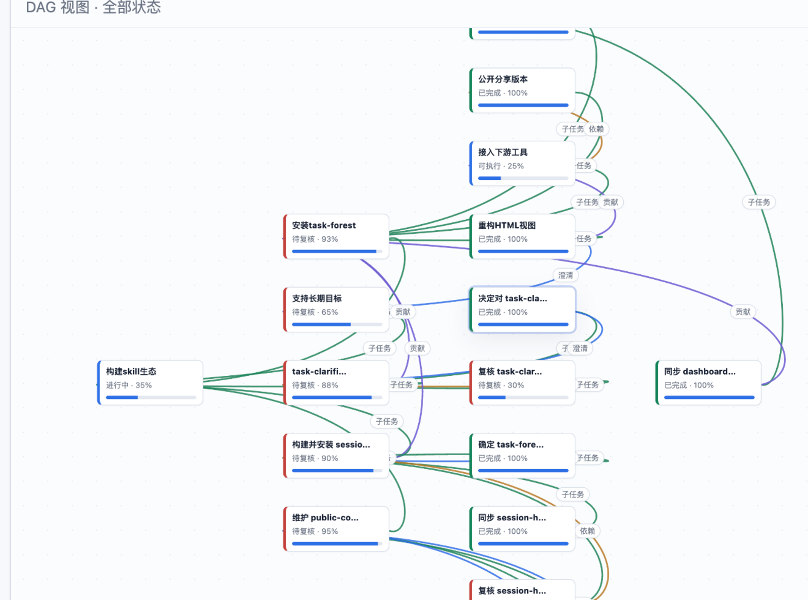
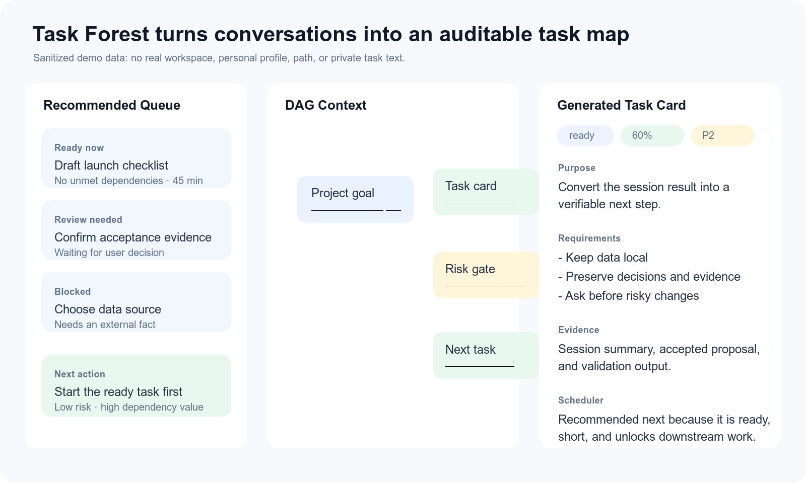
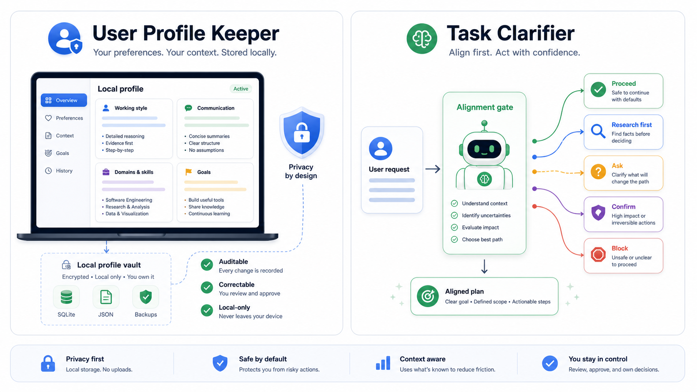
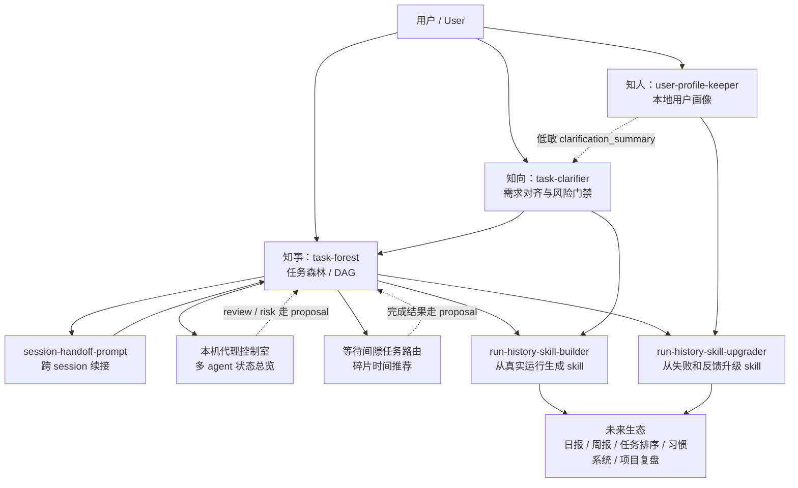

# 司南 COMPASS

[English](README.en.md)

**司南：个性化 AI 任务总控 Skills 系统**  
**COMPASS: Personal Alignment Skills OS for AI Agents**

让 AI 懂你、看全局、不跑偏。COMPASS 把用户画像、任务图谱和需求对齐合成一个可复用的 skills system，让长任务、跨 session 协作和多 agent 工作不再散落在聊天记录里。

## 30 秒看懂它怎么有用

**场景 1：任务开始前，先避免做错。**
当需求模糊、成本高或有安全风险时，用 `$task-clarifier` 先判断应该直接做、先查证、问用户、确认风险还是暂停。它的价值不是多问问题，而是只问会改变执行路径的问题。

**场景 2：任务进行中和结束后，自动沉淀任务地图。**
用 `$task-forest` 把当前 session 的目标、进度、偏差、依赖、待办和决策写成 proposal。确认后生成树视图、DAG 视图、任务详情卡和推荐队列，让下一个 agent 或下一个 session 继续时知道“这件事为什么做、做到哪、下一步做什么”。

**场景 3：长期协作中，让 AI 越来越懂你但不越界。**
用 `$user-profile-keeper` 在本地保存可审计、可纠错、可撤回的协作画像。它只保存用户确认或低敏的协作信号，不保存 secret，不上传数据；`task-clarifier` 只读取低敏摘要来减少无效澄清。

树视图与 session 更新流程：


DAG 关系视图：



任务详情、目的、要求、证据和调度建议：



用户画像与需求对齐的协作方式：



## 为什么需要 COMPASS

普通 agent 很擅长执行当前 prompt，但长任务经常会遇到三个问题：

- **不了解用户**：不知道你的沟通偏好、风险边界、常见遗漏和长期协作方式。
- **看不到全局**：新 session 只看到局部上下文，很难判断当前动作属于哪个长期目标。
- **容易目标漂移**：做完一个任务后，才发现它和原始目的关系很弱，甚至根本不该做。

COMPASS 的核心目标是给 AI agent 一个长期工作底座：先理解用户，再看清任务森林，最后在每次行动前做目标对齐。

## 三省模型

| 层 | Skill | 解决的问题 |
| --- | --- | --- |
| **知人** | [`user-profile-keeper`](skills/user-profile-keeper/) | 本地维护可审计、可纠错、可撤回的用户画像，让 agent 了解用户偏好、风险确认方式和协作边界。 |
| **知事** | [`task-forest`](skills/task-forest/) | 在 repo 内维护任务森林 / DAG，记录长期目标、子任务、依赖、进度、偏差、todo 和历史快照。 |
| **知向** | [`task-clarifier`](skills/task-clarifier/) | 在模糊、高成本、高风险任务前判断应该直接推进、先查证、询问、确认风险还是阻塞。 |

一句话理解：

```text
User Profile Keeper 让 AI 知道“你是谁、怎么协作”。
Task Forest 让 AI 知道“任务在哪里、做到哪里、为什么做”。
Task Clarifier 让 AI 知道“现在该不该做、怎么做才不跑偏”。
```

## 生态图




## 安装和 Agent 兼容

这三个 skills 使用 Python 标准库和 Markdown 文档，不依赖云服务，不上传用户数据。脚本按本地文件工作，已按 macOS、Windows、Linux 三类环境做路径约束：

- macOS / Linux：示例命令使用 `python3`。
- Windows：可使用 `py -3` 或 `python`。
- `task-forest` 数据默认保存在当前 workspace 的 `.agent-workbench/task-forest/`。
- `user-profile-keeper` 数据默认保存在用户目录下的 `.compass-skills/user-profiles/v1`，可用 `COMPASS_USER_PROFILE_HOME` 改到其他本地目录。
- 所有正式写入都在本地文件或本地 SQLite 内完成；没有网络上传、浏览器 cookie 读取、credential 读取或远程写入。

COMPASS 不是 Codex-only。它是一个 agent-agnostic 的 `SKILL.md` skills 包：凡是支持 `SKILL.md`、YAML frontmatter、Markdown instructions、可选 `scripts/` / `references/` 的 agent，都可以原生或近原生使用；暂不原生支持 skills 的 agent，可以通过根目录 [AGENTS.md](AGENTS.md) 做轻量适配。

| Agent / 环境 | 推荐接入方式 |
| --- | --- |
| Codex | 复制 `skills/` 下的三个目录到 Codex 可发现的 skills 目录，或作为 repo-local skills 使用。 |
| Claude Code | 复制 `skills/` 下的三个目录到 Claude Code 的 custom skills 目录，或放入项目 skills 根目录。 |
| OpenClaw | 放入 workspace `skills/`、`.agents/skills` 或个人/托管 skills 目录；按 OpenClaw 的 skill precedence 生效。 |
| OpenCode | 保留本 repo 的 `skills/` 和 [AGENTS.md](AGENTS.md)，让 agent 通过 AGENTS 规则发现并读取对应 `SKILL.md`。 |
| 其他 agent | 只要能读取文件并运行本地脚本，就按 [AGENTS.md](AGENTS.md) 的通用协议加载：先读 `SKILL.md`，再按需读 `references/` 和运行 `scripts/`。 |

通用做法是把 `skills/` 下的三个目录复制到目标 agent 的本地 skills 目录，然后在 session 中点名使用：

```text
$user-profile-keeper
$task-forest
$task-clarifier
```

## 三个核心 skills

### user-profile-keeper：本地用户画像

`user-profile-keeper` 维护一个只保存在本机的用户画像。它记录的是协作偏好、澄清方式、风险边界、能力边界和常见遗漏，不保存 secret，不上传数据，也不把完整画像暴露给其他 skill。`task-clarifier` 只能读取低敏 `clarification_summary`。

**首次构建画像 prompt**

```text
请用 $user-profile-keeper 初始化我的本地用户画像。

目标：通过本地问卷或当前上下文，建立一个可审计、可纠错、可撤回的用户画像。
边界：
1. 只保存到本机，不上传，不读取浏览器 cookie、token 或 credential。
2. 年龄、教育、职业、长期目标等 private 信息先进入待确认 proposal。
3. 不要把本次任务规则误当成长期画像。
4. 完成后告诉我：已写入哪些低敏信息，哪些进入 pending proposal，哪些被跳过。
```

**任意 session 更新画像 prompt**

```text
请用 $user-profile-keeper 从当前 session 更新我的本地用户画像。

请只提取对长期协作有价值的信息，例如沟通偏好、风险确认方式、常见遗漏、能力边界和隐私边界。
低敏、明确、无冲突的信息可以自动应用；推断性、private、敏感或冲突信息必须进入 proposal 等我确认。
不要保存 secret、token、密码、私钥、验证码或浏览器 session 信息。
```

### task-forest：任务森林和进度总控

`task-forest` 在当前 repo 内维护任务森林 / DAG。它不替你执行任务，而是维护任务结构：长期目标、子任务、依赖、进度、偏差、待办、决策和 session 历史。导出的 HTML 可以离线查看树视图、DAG 视图、历史变化和待复核节点。

**构建或更新任务森林 prompt**

```text
请用 $task-forest 分析当前 session，并维护当前 workspace 的任务森林。

目标：把本轮对话中有长期价值的目标、任务、进度、偏差、风险、决策和 follow-up 写成 task-forest proposal。
要求：
1. 先读取当前 task-forest 的 list 和 todo；如果不存在就初始化。
2. 判断本轮工作服务哪个长期目标；找不到关系时不要硬挂，先问我或生成 question/risk。
3. 如果发现某个任务无法达成用户真实目的，记录偏差或提出替代方案。
4. 只保存 proposal，展示准备改什么；等我确认后再 apply。
5. apply 后运行 validate 和 export，并给出 HTML 路径。
```

### task-clarifier：需求对齐和风险门禁

`task-clarifier` 是低打扰但强对齐的任务路由器。它不会把每个不确定性都变成问题，而是判断：能不能先读文件、是否需要联网、是否该问用户、是否必须确认风险、或者是否应该阻塞。

**通用使用 prompt**

```text
请用 $task-clarifier 对齐下面这个任务。

任务：...
材料：...
约束：能从文件、上下文或可靠来源判断的不要问我；只问会改变范围、方法、证据、格式、安全或验收的问题。
输出：说明你会 proceed、research-first、ask、confirm、offer-method-choice 还是 block，并给出理由。
```

## 能做什么

- 新 session 结束时，自动把进度、偏差、决策和待办归入全局任务图。
- 当一个新任务找不到父节点或贡献关系时，提醒用户重新确认目标，而不是强行继续。
- 在任务变复杂、变危险、变模糊时，先进入 alignment gate，避免返工和隐私风险。
- 让用户画像影响“怎么问”，但不替代当前上下文，也不把历史偏好当成绝对事实。
- 为后续日报、周报、任务排序、习惯系统、多 agent 总控、自进化 skill 生态提供结构化底座。

## 安全和隐私

COMPASS 的默认安全边界：

- 不联网、不上传用户画像、不读取浏览器 cookie、token 或 credential。
- 不把完整用户画像提供给普通 skill；只允许读取低敏 `clarification_summary`。
- `task-forest` 的完整任务图保存在 repo-local 目录，不把节点正文写入全局 registry。
- 删除、覆盖、发布、远程写入、credential、全局配置等高风险动作必须确认。
- HTML 导出是静态离线文件，不直接修改任务图。

更多检查见 [SECURITY.md](SECURITY.md)。

## Roadmap

即将开源 / 计划接入：

- `run-history-skill-builder`：从真实任务历史中生成新的可复用 skill。
- `run-history-skill-upgrader`：根据真实失败、用户反馈和验证结果升级已有 skill。
- `session-handoff-prompt`：把长 session 压缩成可续接 prompt，并读取 task-forest 作为结构化来源。
- 本机代理控制室：汇总多个本地 agent 的运行、等待、卡住、风险和待 review 状态。
- 等待间隙任务路由：根据等待时间、精力、切换成本和 task-forest todo 推荐可处理的小任务。
- 日报 / 周报 / 项目复盘：基于用户画像和任务森林自动生成更贴合用户目标的报告。
- 任务排序和 deadline planning：结合任务重量、用户能力、上下文切换成本和 deadline 推荐执行顺序。
- 健康习惯和节奏系统：用任务森林观察长期负载，帮助用户安排更可持续的工作节奏。

## 发布前 checklist

- [ ] 选择并添加开源许可证。
- [ ] 根据目标平台确认安装路径说明。
- [ ] 运行 Python 编译检查和 task-forest 从零构建验证。
- [ ] 扫描是否包含私有路径、token、credential、内部日志或运行残留。
- [ ] 在一个全新 workspace 里试用三个 prompt。
